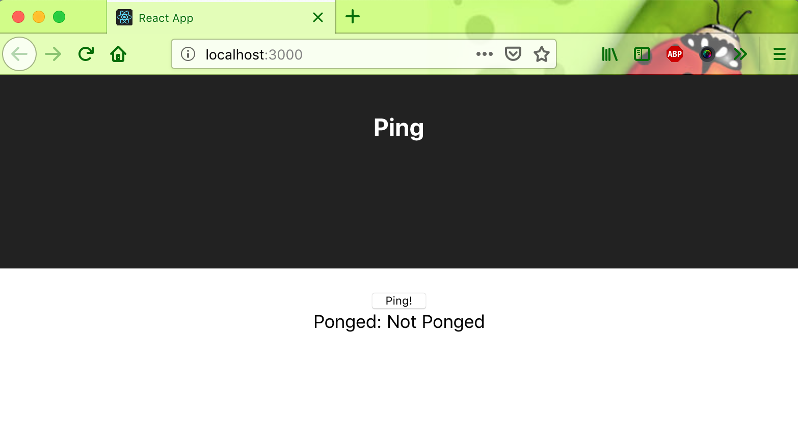
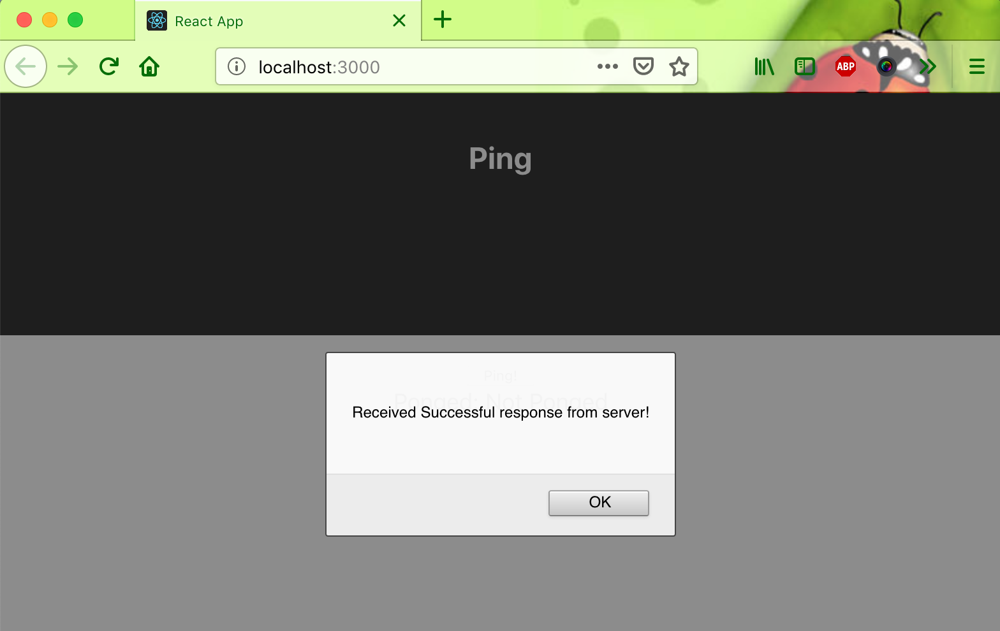
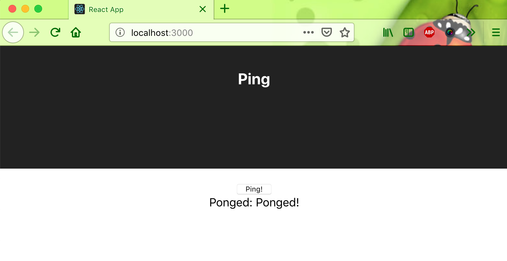

# spring-boot-reactjs-example

### Things to do to run this project :

1. Run this command : `https://github.com/hendisantika/spring-boot-reactjs-example.git`.
2. Go to the foder --> `cd spring-boot-reactjs-example`.
3. `cd frontend` for frontend then `npm install && npm start`.
3. `cd backend` then `mvn clean spring-boot:run`

### Screen shot

Home Page

Ping Page

Pong Page

